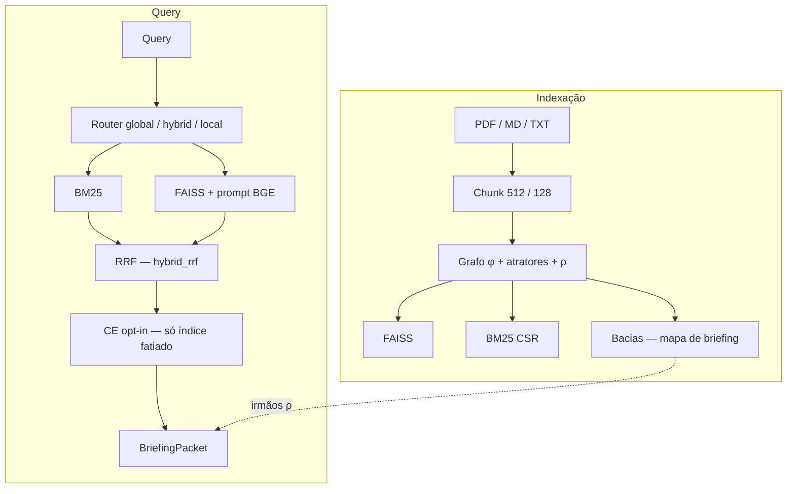
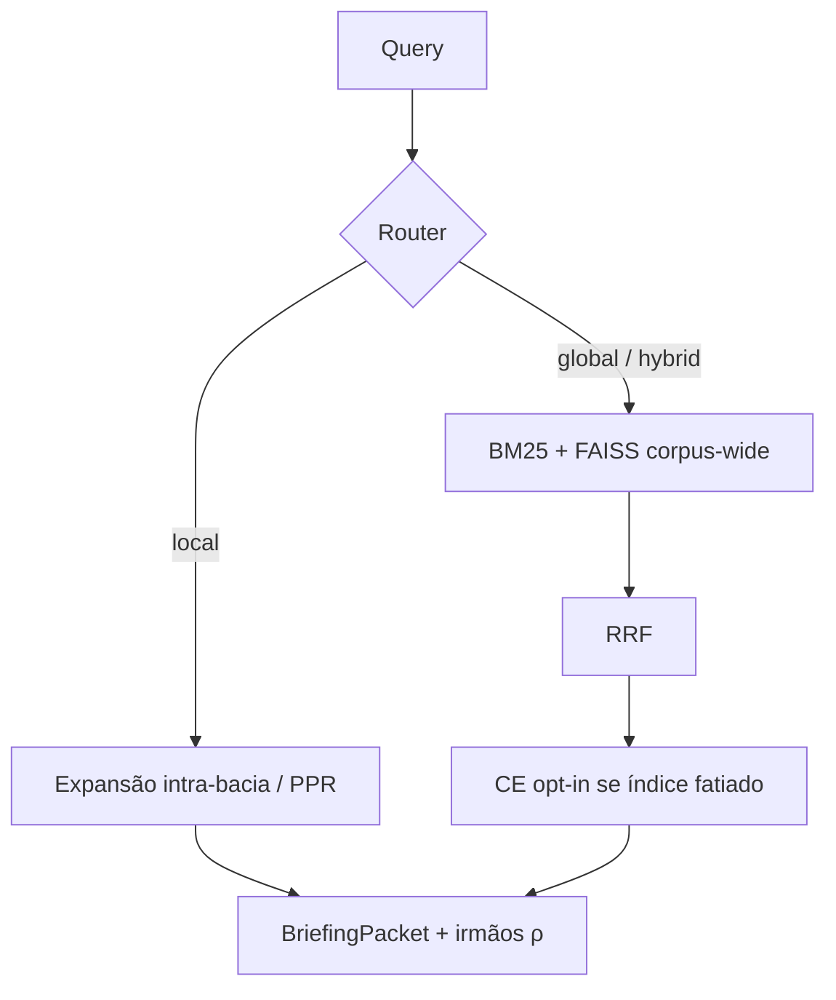

# Arquitetura do BasinRAG

BasinRAG é um RAG híbrido **BM25 + FAISS** com bacias de atração como **mapa de briefing** (vizinhança de contexto para o LLM). Ranking de produção: [`docs/RANKING.md`](docs/RANKING.md). Números: [`BENCHMARKS.md`](BENCHMARKS.md) e [`docs/EVAL.md`](docs/EVAL.md).

## 1. Visão geral

Documentos são estruturados com um grafo funcional sequencial e partições em bacias; a recuperação combina lexical e denso. A topologia confina e expande **contexto**; o ranking em `hybrid_rrf` não usa hop/DRF.

## 2. Fundamentação (o que a matemática faz no produto)

### 2.1 Grafo funcional discreto

Corpus como grafo $G=(V,E)$ com função de sucessão:

$$ \phi: V \to V \cup \{\emptyset\} $$

Cada chunk tem no máximo uma aresta de saída ao sucessor lógico (ou $\emptyset$).

### 2.2 Atratores e bacias

Sumidouros estruturais $A_i$ (âncoras de seção / núcleo). Bacia:

$$ B(A_i) = \{ v \in V \mid \phi^k(v) = A_i \text{ para algum } k \ge 0 \} $$

### 2.3 Árvores $\rho$ e hops

Profundidade topológica $h(v)$ relativa ao atrator. Em corpora **flat** (1 doc = 1 nó), $h(v)=0$ e a geometria de bacia não molda hops — caso SciFact.

### 2.4 Backbone vs sinapses

1. **Topologia primária:** fluxo / hierarquia do documento.  
2. **Sinapses virtuais:** kNN semântico (secundário, cross-basin).

## 3. Pipeline de indexação

* **Split:** padrão **512** caracteres / overlap **128** (não 1000/100). IDs SHA-256.  
* **Esparso:** BM25 CSR ($k_1=1.2$, $b=0.75$), vocabulário bilíngue.  
* **Denso:** `BAAI/bge-base-en-v1.5` (768d, L2), FAISS FlatIP se $N \le 20000$, senão HNSW (`efSearch=256`).  
* **Níveis de contexto:** L0 texto; L1 keywords; L2 sentenças; L3 resumos opcionais (LLM em background).  
* **Persistência:** `storage_dir/builds/<build_id>/` + ponteiro atômico `current.json`.

## 4. Pipeline de recuperação

Contrato detalhado: [`docs/RANKING.md`](docs/RANKING.md).

**Default (`hybrid_rrf`):** RRF ponderado. Hop/DRF não reordenam sementes. `brief()` hidrata irmãos da árvore ρ depois das sementes. Índices flat 1:1 não acrescentam contexto de bacia.

**Opt-in (`experimental_topology`):** hop prior (`missing=neutral` no produto experimental; `penalty` só no gate) e DRF entram no ranking. Avaliar por ablação.

- **Router:** regex + centroides → `global` / `hybrid` / `local`.
- **Cross-encoder:** desligado por padrão. Se `use_rerank=True`, `BAAI/bge-reranker-v2-m3` só em índices fatiados.
- **Briefing:** hubs, vizinhos, metadados de bacia — entrada para o LLM, não métrica MTEB.

## 5. Sumarização L3 em background

Daemon opcional Draft → Critique → Refine para L3, assíncrono, sem bloquear a busca.

## 6. Persistência e concorrência

* Save em `builds/<build_id>/` (grafo, embeddings, BM25, SQLite, bacias).  
* Atomicidade via `os.replace` em `current.json` (Windows + SQLite).  
* `ingest()` mescla por `id`; `reindex(path)` reconstrói do zero.

## 7. Complexidade (ordem de grandeza)

* Build de bacias / $\rho$: tipicamente linear no número de nós do backbone.  
* Lookup: BM25 + FAISS top-$k$ + fusão; expansão local limitada à vizinhança.
