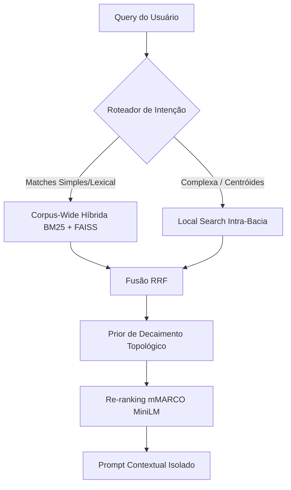

# Arquitetura do BasinRAG

Este documento detalha o design do sistema, a fundamentação matemática e as escolhas de engenharia por trás do **BasinRAG**, um sistema state-of-the-art de RAG (Retrieval-Augmented Generation) Topológico para processamento determinístico e escalável de documentos complexos.

## 1. Visão Geral e Filosofia Arquitetural

Abordagens de RAG baseadas em grafos de conhecimento com clustering comunitário (como algoritmos derivados de Leiden ou Louvain) dependem frequentemente de extrações semânticas iterativas, as quais podem introduzir dispersão e sensibilidade estrutural em grafos densamente conectados.

A filosofia arquitetural do BasinRAG fundamenta-se no conceito de **RAG Topológico Determinístico**. O conhecimento é estruturado não através de grafos bipartidos irrestritos, mas por meio de partições determinísticas derivadas da estrutura sequencial e temática de leitura do documento. Essa formulação confina a propagação do contexto e assegura uma recuperação reprodutível e de alta precisão.

## 2. Fundamentação Matemática Formal

O cerne operacional do BasinRAG baseia-se na teoria dos sistemas dinâmicos em espaços discretos. O documento é modelado com uma separação estrita entre a topologia informacional inerente e suas relações virtuais.

### 2.1 Grafo Funcional Discreto

Definimos o corpus como um grafo direcionado $G = (V, E)$. Ao contrário de grafos arbitrários, o fluxo sequencial do documento estabelece um **Grafo Funcional Discreto** suportado por uma função determinística de mapeamento:

$$ \phi: V \to V \cup \{\emptyset\} $$

onde cada nó (chunk) $v \in V$ possui no máximo uma aresta de saída que aponta para o nó que o sucede logicamente ou para $\emptyset$ em partições terminais. 

### 2.2 Sumidouros Estruturais e Atratores

Dentro do grafo funcional de um documento formal, introduzimos o conceito de **Sumidouros Estruturais** (Atratores) $A_i$. Eles representam as âncoras semânticas primárias, tais como os cabeçalhos das seções e parágrafos-chaves. Tais atratores ancoram a informação em sua órbita.

### 2.3 Partição em Bacias de Atração

Com a função $\phi$ estabelecida, particionamos $V$ estritamente nas bacias:

$$ B(A_i) = \{ v \in V \mid \phi^k(v) = A_i \text{ para algum } k \ge 0 \} $$

Essa partição garante que qualquer recuperação semântica inicie restrita a um limite topológico claro, resolvendo o problema de contexto desfocado.

### 2.4 Árvores de Predecessores $\rho$ e Profundidade Topológica

Para cada bacia $B(A_i)$, forma-se uma árvore de predecessores $\rho$, orientada para o atrator. A **Profundidade Topológica**, ou número de saltos estruturais em relação ao atrator, é capturada por uma função de saltos (hops):

$$ h(v): V \to \mathbb{Z}_{\ge 0} $$

### 2.5 Separação Estrita (Topologia Primária vs Sinapses Virtuais)

O BasinRAG isola:
1. **Topologia Primária (Backbone)**: Determinada matematicamente pela estrutura hierárquica e fluxo do documento.
2. **Sinapses Semânticas Virtuais**: Calculadas via similaridade de cossenos $k$-NN ($> 0.85$), modelando correlações transversais. Estas só são acionadas como um mecanismo *cross-basin* secundário.

## 3. Pipeline de Indexação Unificada

O sistema consolida a extração de forma multiformato num indexador altamente otimizado.

* **Ingestão e Splitting Determinístico:** Suporte robusto para PDF, MD, e TXT. O documento é segmentado de maneira hierárquica (1000 caracteres / 100 caracteres de overlap). Para evitar recálculos redundantes e permitir consistência transacional, IDs determinísticos baseados em **SHA-256** são usados como chaves primárias.
* **Representação Híbrida Avançada:**
  * **Esparsa:** Matrizes CSR para indexação eficiente BM25, rigorosamente calibradas para vocabulário denso ($k_1 = 1.2$, $b = 0.75$).
  * **Densa:** Encoders MiniLM bilíngues (L2-normalizados), indexados utilizando o padrão ouro via **FAISS** em índices `FlatIP` e `HNSW` para suporte de vizinhança de alta performance.
* **Condensação de Contexto Multinível:** O BasinRAG estrutura os metadados do embedding numa hierarquia piramidal:
  * L0: Texto integral.
  * L1: Keywords lexicais purificadas.
  * L2: Sentenças nucleares.
  * L3: Resumos de domínio sintéticos de seção.

## 4. Pipeline de Recuperação e Roteamento Híbrido

Para superar o obstáculo comum de tempo de latência em sistemas RAG complexos, implementamos um pipeline de recuperação com resolução assíncrona baseada em intenção.

### Diagrama de Fluxo (Recuperação Híbrida Topológica)

* **Roteador de Intenção:** Um Fast-path de Expressão Regular (Regex PT/EN) acoplado com Classificação via Centroides Semânticos para determinar rapidamente a estratégia de busca (Local ou Global).
* **Busca Híbrida vs Local:** Transição sem atritos entre uma busca paralela global do corpus inteiro e uma escavação intra-bacia para responder perguntas que dependem da vizinhança de um nó primário.
* **Fusão e Prior Topológico:** 
  A agregação de scores utiliza uma variante aprimorada de Reciprocal Rank Fusion (Weighted RRF, $\alpha=0.55$). Esta é multiplicada por um prior exponencial baseado na topologia $h(v)$ e taxa de decaimento $\lambda$, favorecendo nós estruturalmente centrais:
  
  $$ S_{\text{final}}(v) = S_{\text{RRF}}(v) \cdot (0.7 + 0.3 \cdot e^{-h(v) \cdot \lambda}) $$
  
* **Re-ranking Isolado:** Aplicamos os pesos através de um Cross-Encoder Multilíngue (mMARCO MiniLM).

## 5. Sumarização Agentic em Background

O BasinRAG inclui um Daemon concorrente para resumir o conteúdo recuperado, estruturado num pipeline estrito: **Draft $\to$ Critique $\to$ Refine**. Essa rotina de sumarização autônoma condensa insights de bacias longas em representações L3, mantendo sempre o encapsulamento assíncrono. O refinamento semântico não trava o *event loop* primário de busca.

## 6. Persistência Atômica e Concorrência

Para suportar ambientes pesados:
* Implementação com integridade via substituição atômica nos sistemas de arquivos (`os.replace`).
* Isolamento de cache de busca em banco KVStore nativo (SQLite), transacionado rigidamente com WAL (Write-Ahead Logging).
* Suporte total à segurança de thread no loop I/O. Recuperação instântanea sem corrupção no caso de crash elétrico/de processo.

## 7. Complexidade Algorítmica e Escalabilidade

O sistema afasta o Gargalo de Clusterização típico (como Leiden) que atinge em pior caso escalas polinomiais:
* **Tempo de Indexação (Build):** Ao compilar a árvore $\rho$ e montar as bacias funcionalmente via IDs determinísticos, nós atingimos complexidade estritamente linear $O(N)$, sem matrizes densas de co-ocorrência.
* **Tempo de Busca (Lookup):** Utilizando índices vetoriais hierárquicos e escopo limitador de bacias, nosso query lookup permanece estritamente ligado a $O(K + \log N)$, em que $K$ representa os hits retornados no nível global e intra-bacia, sendo formidável para grandes corpuses multilinguísticos.
