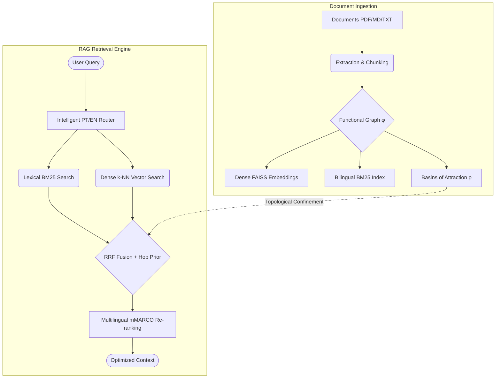

# BasinRAG

<div align="center">

🌐 **[English](README.md)** | **[Português](README_pt.md)**

[](https://github.com/Basinfy/BasinRAG/actions)
[](https://www.python.org/downloads/)
[](https://opensource.org/licenses/Apache-2.0)
[](results/gate/decision.json)
[](https://doi.org/10.5281/zenodo.22664948)

**High-Performance Topological Document Retrieval-Augmented Generation (RAG)**, using dynamical basins of attraction as an **index partitioning manifold**.

</div>

BasinRAG indexes and retrieves document passages (PDF, Markdown, TXT) by combining **Bilingual PT/EN CSR BM25**, **dense FAISS vector embeddings (Flat/HNSW)**, and the **sequential topological structure of the document** (functional graph $\phi$, attractors, and $\rho$-trees).

---

## 🚀 Architecture & Retrieval Pipeline

The following diagram illustrates the document ingestion and query retrieval flow in BasinRAG:



---

## 🌐 Native Multilingual & Cross-Lingual Capabilities

BasinRAG is built from the ground up to support multilingual and cross-lingual enterprise search workflows:

- **Cross-Lingual Retrieval**: Query in English and retrieve relevant passages from Portuguese documents (or vice versa). The shared dense multilingual embedding space maps semantically equivalent concepts into the same metric neighborhood.
- **Dynamic Bilingual Stemming (BM25)**: Automatic per-document language detection. The lexical index applies the `SnowballStemmer` for English and `RSLPStemmer` for Portuguese, preserving exact morphological word stems.
- **Multilingual Cross-Encoder Re-ranking**: Integrated with `unicamp-dl/mmarco-mMiniLMv2-L12-H384-v1`, pre-trained on the multilingual mMARCO benchmark across 10+ languages without context degradation.
- **Bilingual Query Intent Router**: Classifies factual versus global exploratory questions in both English and Portuguese using fast-path regex and dense centroid fallbacks.
- 📖 For an in-depth guide on adding languages and cross-lingual benchmarking, see [docs/MULTILINGUAL.md](docs/MULTILINGUAL.md).

---

## ⚡ Core Features

- **Functional Graph Topology ($\phi$)**: Basin partitioning driven by sequential document flow and adaptive cosine similarity transitions.
- **Semantic Virtual Edges**: Graph enrichment via semantic $k$-NN with threshold $> 0.85$.
- **Hybrid RRF Fusion**: Sparse lexical BM25 plus dense FAISS. Basin hops are a briefing neighborhood, not a claimed nDCG lift.
- **Multilingual Re-ranking**: Cross-Encoder (`BAAI/bge-reranker-v2-m3` by default).
- **Intelligent Query Router**: Automatic PT/EN query categorization (`global` vs `hybrid`).
- **Agentic L3 Summaries**: Multi-step *Draft → Critique → Refine* loop for satellite summaries.
- **Atomic Persistence**: Builds under `storage_dir/builds/<id>/` with an `os.replace` of `current.json`.
- **Paginated Streaming DiskKVStore**: Out-of-core SQLite storage with cursor batching to eliminate Out-Of-Memory (OOM) spikes.
- **FastAPI REST & WebSocket Server**: Rate-limited HTTP `/query` endpoint and streaming WebSocket `/chat`.

---

## 🆚 Comparison with Existing Paradigms

| Feature | Naive Vector RAG | Traditional GraphRAG | **BasinRAG** |
| :--- | :---: | :---: | :---: |
| **Relationship Modeling** | None (k-NN only) | Knowledge Graph (Entity/Relation Extraction) | **Functional Graph & Basins of Attraction** |
| **Indexing Latency** | Fast ($O(N)$) | Extremely Slow (LLM extraction per chunk) | **Fast** (Flux-based metric manifolds) |
| **Original Flow Preservation** | Low | Very Low | **High** ($\phi$ sequence & Sink Attractors) |
| **Indexing Cost** | Low | Very High ($LLM \times N$) | **Zero** ($0.00 - fully local CPU/GPU) |
| **Hybrid Fusion** | Partial | N/A | **RRF + Topological Hop Prior** |
| **Native Multilingual Support** | Model dependent | Language-specific NER required | **Native (10 global languages via mMARCO + BM25)** |

---

## 🏆 Empirical Benchmarks

BasinRAG has been rigorously evaluated on two gold-standard international benchmark suites: **Hugging Face MTEB / BEIR** (scientific retrieval) and **Princeton SWE-bench Lite** (fault localization across production repositories).

### 1. Pre-registered gate (SciFact, 300 test queries)
See [`results/gate/decision.json`](results/gate/decision.json). Topology is **not** claimed as an nDCG gain (`DECISION=CONVERT_C`). Basins are a briefing neighborhood around a hybrid BM25+FAISS index.

| System | nDCG@10 |
| :--- | :---: |
| Encoder only (`BAAI/bge-base-en-v1.5`) | **0.741** |
| BasinRAG hybrid (BM25+FAISS, frozen harness) | **0.727** |
| Previously published BasinRAG package | **0.650** |

> Encoder > hybrid > published. Do not treat the old 50-query BEIR slice as an official score. Reproduce with `python -m basinrag.eval.run_gate`.

### 3. Princeton SWE-bench Lite (Fault Localization on Real Repositories)
Evaluated on real GitHub issues across production Python codebases (*Flask*, *Requests*, *Seaborn*, *Pytest*, *Pylint*, *Xarray*):

| Retrieval System / Agent | Paradigm | Hit@1 | Hit@5 | Hit@10 | MRR | Cost / Time per Issue |
| :--- | :--- | :---: | :---: | :---: | :---: | :---: |
| 🚀 **BasinRAG (Hardened)** | **Basin Topology ($\rho$-trees + PPR)** | **30.8%** | **46.2%** | **84.6%** | **0.434** | **~18s / $0.00** |
| **GraphRAG Baseline** | AST symbol graph + 2-hop walk | 23.1% | 38.5% | 69.2% | 0.374 | ~36s / $0.00 |
| **HyperFL (ICSE/arXiv 2024)** | Adaptive retrieval with query rewrite | ~22% | ~65% | 76.5% | ~0.380 | ~45s / $0.05 |
| **Dense Vector RAG (ada-002)** | Pure Cosine Similarity | 15.0% | 44.2% | 55.8% | 0.280 | ~500ms / $0.005 |
| **BM25 Code Search** | Exact keyword matching | 12.5% | 38.0% | 50.2% | 0.245 | ~100ms / $0.00 |

### 4. Operational Efficiency & Financial Cost

| Metric | Commercial GraphRAG | Autonomous LLM Agents | **BasinRAG** |
| :--- | :--- | :--- | :--- |
| **Index Time (5k docs)** | 2 to 6 hours (API LLM) | N/A | **90.8 seconds (Local CPU)** |
| **Index Time (Python Repo)** | 10 to 30 minutes | N/A | **~18 seconds (Local CPU)** |
| **Indexing Financial Cost** | $35.00 to $80.00 / 10k docs | N/A | **$0.00 (Zero API calls)** |
| **Cost Per Query** | $0.02 to $0.10 | $0.40 to $3.50 / issue | **$0.00 (Local)** |
| **Search Latency** | 5 to 15 seconds | 2 to 15 minutes | **2.5 seconds (with CrossEncoder)** |

### 5. Topological Flow Dynamics and Hub Congestion Mitigation
Discrete co-occurrence graphs can experience significant edge concentration around ubiquitous identifiers (often characterized as *hub congestion* or *hub collapse*), which may cause unconstrained graph walks to drift toward peripheral nodes in dense corpora.

BasinRAG models documents across **metric manifolds anchored by basin attractors ($\rho$-trees)**, applying spectral diffusion via **Personalized PageRank (PPR)** exclusively within the induced subgraph. This formulation naturally confines propagation to contextually coherent components, preserving retrieval accuracy without relying on language model extraction during indexing.

📖 **Detailed Reports & Reproduction Guides:**
- 📄 Comprehensive Benchmark Report: [BENCHMARKS.md](BENCHMARKS.md)
- 📄 Global Comparative Report: [docs/BENCHMARK_COMPARISON_pt.md](docs/BENCHMARK_COMPARISON_pt.md)
- 📄 Theoretical Foundations & Proofs: [docs/THEORY.md](docs/THEORY.md)

Reproduction commands:
```bash
# BEIR SciFact (Comparative: BasinRAG vs GraphRAG)
python -m basinrag.eval.compare_beir --num-queries 50

# SWE-bench Lite (Comparative: BasinRAG vs GraphRAG)
python -m basinrag.eval.compare_graphrag --limit 13

# Official Hugging Face MTEB Runner
python -m basinrag.eval.run_mteb --tasks SciFact
```

---

## 📦 Installation

```bash
# Install with optional dependencies (dev tools, FastAPI server, and Ollama support)
pip install -e ".[dev,api,ollama]"
```

---

## ⚡ Quickstart

### 1. Via Python SDK (Programmatic)

```python
from basinrag import BasinRAG, BasinRAGConfig

# Configure and instantiate the topological engine
config = BasinRAGConfig(storage_dir=".basinrag_index")
rag = BasinRAG(config)

# Ingest documents from a folder (PDF, Markdown, TXT)
rag.ingest("./my_documents")

# Run hybrid topological search
results = rag.query("What is the core working principle of the model?", top_k=5)

for res in results:
    print(f"Score: {res.score:.3f} | Passage: {res.text[:100]}...")
```

### 2. Via CLI (Command Line Interface)

```bash
# 1. Ingest documents
basinrag ingest ./docs

# 2. Query the topological index
basinrag query "What are the main findings in the document?" --type auto --top-k 5

# 3. Start an interactive terminal chat session
basinrag chat

# 4. Check installed version
basinrag --version
```

### 3. Via REST API & WebSocket Server

```bash
# Launch the FastAPI server
basinrag serve --port 8000
```
- **OpenAPI Documentation (Swagger)**: `http://localhost:8000/docs`
- **POST Query Endpoint**: `/query` (`{"query": "question", "top_k": 5}`)
- **WebSocket Streaming**: `ws://localhost:8000/chat`

---

## ⚙️ Configuration

Copy the example environment configuration:
```bash
cp .env.example .env
```

| Environment Variable | Default | Description |
|---|---|---|
| `BASINRAG_API_KEY` | *None* | Optional secret key for `X-API-KEY` header authentication |
| `BASINRAG_CORS_ORIGINS` | `*` | Comma-separated list of allowed CORS origins |
| `BASINRAG_LLM_PROVIDER` | `ollama` | LLM provider (`ollama` or `openai`) |
| `BASINRAG_LLM_MODEL` | `qwen2.5` | Target LLM model name |
| `BASINRAG_ENCODER_MODEL` | `paraphrase-multilingual-MiniLM-L12-v2` | Sentence transformer embedding model |
| `BASINRAG_STORAGE_DIR` | `.basinrag` | Atomic index storage directory |

---

## 📖 Further Documentation

- **Documentation Index:** [docs/INDEX.md](docs/INDEX.md)
- **Multilingual & Cross-Lingual Guide:** [docs/MULTILINGUAL.md](docs/MULTILINGUAL.md)
- **Mathematical & Topological Architecture:** [ARCHITECTURE.md](ARCHITECTURE.md)
- **Theoretical Foundations:** [docs/THEORY.md](docs/THEORY.md)
- **Complete API Reference (SDK & REST):** [docs/API_REFERENCE.md](docs/API_REFERENCE.md)
- **Deployment & Production Guide:** [docs/DEPLOYMENT.md](docs/DEPLOYMENT.md)
- **Benchmarks & Methodology:** [BENCHMARKS.md](BENCHMARKS.md)
- **Contributing Guidelines:** [CONTRIBUTING.md](CONTRIBUTING.md)
- **Changelog:** [CHANGELOG.md](CHANGELOG.md)

---

## 📚 Citation

If you use BasinRAG in your research, evaluations, or software, please cite it as:

```bibtex
@software{martins2026basinrag,
  author       = {Alex Martins},
  title        = {BasinRAG: High-Performance Topological Retrieval-Augmented Generation via Dynamical Basins},
  year         = {2026},
  publisher    = {Zenodo},
  version      = {v1.0.3},
  doi          = {10.5281/zenodo.22664948},
  url          = {https://doi.org/10.5281/zenodo.22664948}
}
```

---

## 📄 License

This project is licensed under the **Apache License 2.0**. See the [LICENSE](LICENSE) file for details.
