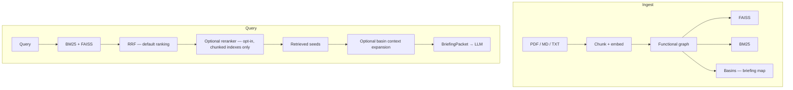

# BasinRAG

<div align="center">

🌐 **[English](README.md)** | **[Português](README_pt.md)**

[](https://www.python.org/downloads/)
[](https://opensource.org/licenses/Apache-2.0)

**Basinfy’s local hybrid retrieval system:** BM25 + FAISS, with document basins used as a structured briefing map for an LLM.

</div>

## What BasinRAG does

BasinRAG indexes PDF, Markdown, and TXT documents locally. Its default retrieval ranking fuses sparse BM25 and dense FAISS results with reciprocal rank fusion (RRF). A functional graph groups related chunks into basins that can expand the context sent to a generator; topology does not change the default seed ranking.

| Capability | Role |
| :--- | :--- |
| Local hybrid retrieval | BM25 finds exact terms and IDs; FAISS finds semantic matches; RRF fuses their ranks. |
| Briefing structure | Basin hubs and neighbors can add context around retrieved seeds. |
| Local indexing | No LLM entity extraction or community-summary pass is required to build an index. |
| Snapshot persistence | Immutable generations are written under `.basinrag/builds/` and published through `current.json`. |

`experimental_topology` is an opt-in ranking mode. It is not the production default and should be evaluated by ablation on the same candidate set before use.

## Architecture



## Install

From a source checkout, install the extras you intend to use:

```bash
python -m pip install ".[api,ollama]"
```

For development and evaluation, install `.[dev,api,eval]`. Ollama and OpenAI integrations are optional; install `.[ollama]` or `.[openai]` for the selected provider.

## Quickstart

```python
from basinrag import BasinRAG, BasinRAGConfig

rag = BasinRAG(BasinRAGConfig(storage_dir=".basinrag"))
rag.ingest("./my_documents")
docs = rag.query("What is the core working principle?", top_k=5)
```

The current reader requires the current snapshot format. Legacy indexes are left untouched; rebuild from original sources into a new, empty `.basinrag` directory before switching over:

```bash
basinrag reindex ./my_documents --storage-dir ./.basinrag
```

`ingest` is additive and idempotent: new sources are added, unchanged sources are no-ops, and changed sources require `sync`. `sync` reflects changes and removals in the selected scope. A failed or racing read does not publish a partial snapshot.

```bash
basinrag ingest ./docs
basinrag sync ./docs
basinrag query "What are the main findings?" --type hybrid --top-k 5
basinrag chat
basinrag serve --host 127.0.0.1 --port 8000
```

To call the ASGI application directly, use `uvicorn basinrag.api.server:app`. Public clients require `BASINRAG_API_KEY`; the CLI also refuses a non-loopback bind without a key. Keep the service behind a TLS-terminating reverse proxy when exposing it to a network.

## HTTP API

| Route | Role |
|---|---|
| `GET /livez` | Process is up |
| `GET /readyz` | Snapshot and query dependencies are ready |
| `POST /query` | Retrieval (`Authorization: Bearer`) |
| `WS /chat` | Streaming chat (same-origin cookie or Bearer) |

There is no `/v2` prefix. Details: [API reference](docs/API_REFERENCE.md) and [deployment](docs/DEPLOYMENT.md).

## Configuration

`BasinRAGConfig` accepts explicit values. Configuration precedence is **explicit constructor/CLI arguments > process environment > `.env` > class defaults**. The process environment wins over values loaded from `.env`.

| Environment variable | Default | Description |
|---|---|---|
| `BASINRAG_STORAGE_DIR` | `.basinrag` | Index and build storage root. |
| `BASINRAG_ENCODER_MODEL` | `BAAI/bge-base-en-v1.5` | Dense encoder. Reindex after changing the encoder. |
| `BASINRAG_RERANKER_MODEL` | `BAAI/bge-reranker-v2-m3` | Optional cross-encoder model. |
| `BASINRAG_LLM_PROVIDER` | `ollama` | `ollama` or `openai`; chat/L3 only. |
| `BASINRAG_LLM_MODEL` | `qwen2.5` | Chat/L3 model name. |
| `BASINRAG_SEARCH_TYPE` | `auto` | Default retrieval mode. |
| `BASINRAG_RANKING_MODE` | `hybrid_rrf` | `hybrid_rrf` or opt-in `experimental_topology`. |
| `BASINRAG_USE_RERANK` | `false` | Opt in to the cross-encoder after retrieval on chunked indexes. |
| `BASINRAG_CHUNK_SIZE` | `512` | Legacy chunk size in characters. |
| `BASINRAG_CHUNK_OVERLAP` | `128` | Legacy overlap in characters. |
| `BASINRAG_CHUNK_SIZE_TOKENS` | unset | Optional token-based chunk limit, bounded by encoder capacity. |
| `BASINRAG_CHUNK_OVERLAP_TOKENS` | unset | Optional token overlap; requires token chunk size. |
| `BASINRAG_EMBEDDING_BATCH_SIZE` | `64` | Number of texts encoded per batch. |
| `BASINRAG_MIN_CONFIDENCE` | `0.15` | Current chat abstention threshold; confidence is not a calibrated probability. |
| `BASINRAG_QUERY_PROMPT` | BGE search instruction | Encoder query prefix. |
| `BASINRAG_API_KEY` | unset | Required for API startup except explicit keyless local development. |
| `BASINRAG_CORS_ORIGINS` | localhost origins | Comma-separated allowed browser origins. |
| `BASINRAG_ENV` | `production` | `local_dev` only with explicit keyless opt-in and loopback bind. |
| `BASINRAG_ENABLE_BACKGROUND_L3` | `false` | Enable background summarization. |
| `BASINRAG_ALLOW_REMOTE_L3_EGRESS` | `false` | Separately opt in to sending excerpts to a remote LLM for L3. |
| `BASINRAG_BM25_STEMMING` | `false` | Optional BM25 stemming; recorded in the snapshot manifest. |
| `BASINRAG_CONTEXT_WINDOW_TOKENS` | `8192` | Chat context window. |
| `BASINRAG_GENERATION_RESERVE_TOKENS` | `1024` | Tokens reserved for generation. |

The `.env.example` file lists these settings. Legacy character-based chunk arguments remain supported; chunks that exceed the encoder’s token capacity are automatically split again, and token settings are additive. Existing indexes are not silently rewritten when chunk settings change.

## Security notes

Retrieved documents are untrusted input. They can contain misleading instructions or prompt-injection text. BasinRAG retrieval is not a sanitizer and does not guarantee that a connected LLM will ignore those instructions. Keep source collections trusted, delimit retrieved passages in application prompts, and require the generator to treat them as evidence rather than instructions.

The API requires a key at startup unless `BASINRAG_ENV=local_dev` and `BASINRAG_ALLOW_KEYLESS_LOCAL=true` are both set with a loopback bind. Forwarded IP headers only affect rate limiting when the direct peer is in `BASINRAG_TRUSTED_PROXIES`; they never authenticate. L3 is off by default, and remote excerpt egress requires both L3 opt-ins.

## Evaluation

Benchmark artifacts already in the repository are historical and may predate the current source changes. Do not treat them as a current release score. Re-run each evaluation into a fresh output directory; the report should include the revision, model, corpus/split, configuration, requested tasks, and successful tasks. Never aggregate stale task files or report an incomplete run as a complete mean.

See [BENCHMARKS.md](BENCHMARKS.md) for the reproduction protocol and [docs/EVAL.md](docs/EVAL.md) for gate commands and single-task measurements. SWE-bench file-retrieval metrics are not SWE-bench `% Resolved`; only patches evaluated by the official Docker harness support that claim.

## Documentation

- [Ranking (flat vs long-doc)](docs/RANKING.md)
- [Evaluation](docs/EVAL.md)
- [Benchmark protocol](BENCHMARKS.md)
- [Architecture](ARCHITECTURE.md)
- [API reference](docs/API_REFERENCE.md)
- [Deployment](docs/DEPLOYMENT.md)
- [Contributing](CONTRIBUTING.md)
- [Security policy](SECURITY.md)
- [Portuguese README](README_pt.md)
- [Docs index](docs/INDEX.md)

## Citation

```bibtex
@software{martins2026basinrag,
  author       = {Alex Martins},
  title        = {BasinRAG: Hybrid Retrieval with Dynamical Basins as Briefing Maps},
  year         = {2026},
  publisher    = {Basinfy},
  version      = {v1.1.0},
  doi          = {10.5281/zenodo.22664948},
  url          = {https://doi.org/10.5281/zenodo.22664948}
}
```

## License

Apache License 2.0 — see [LICENSE](LICENSE).
