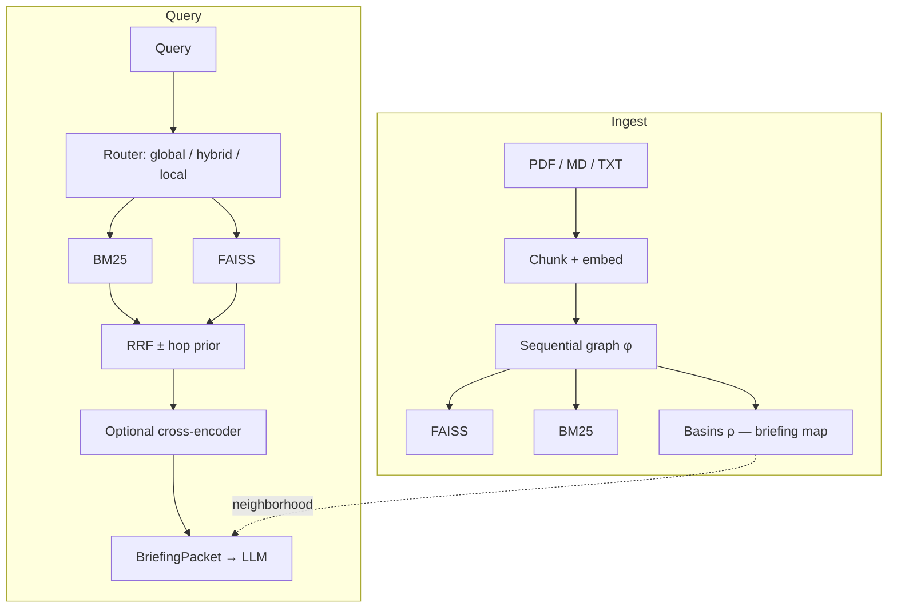

# BasinRAG

<div align="center">

🌐 **[English](README.md)** | **[Português](README_pt.md)**

[](https://www.python.org/downloads/)
[](https://opensource.org/licenses/Apache-2.0)
[](results/gate/decision.json)
[](https://doi.org/10.5281/zenodo.22664948)

**Hybrid BM25 + FAISS RAG** with document basins as a structured **briefing map** for the LLM.

</div>

## What BasinRAG is

BasinRAG is a **local hybrid retrieval stack** for PDF / Markdown / TXT:

1. **Sparse:** bilingual CSR BM25  
2. **Dense:** FAISS over `BAAI/bge-base-en-v1.5` (default)  
3. **Structure:** sequential functional graph $\phi$, attractors, and $\rho$-trees → **basins**

Basins define a **context neighborhood** for briefing (hubs, neighbors, optional L3). Ranking on flat corpora is driven by the hybrid BM25 + FAISS path. Gate decision: [`results/gate/decision.json`](results/gate/decision.json) (`CONVERT_C`).

| Capability | Role |
| :--- | :--- |
| **$0 LLM indexing** | No entity extraction or community summaries at ingest |
| **Hybrid lexical + dense** | BM25 for rare terms / IDs; dense for paraphrase |
| **Structured briefing** | Hubs, neighbors, optional L3 for the generator |
| **Local deterministic index** | Builds under `.basinrag/builds/<id>/` |

---

## Architecture



---

## Benchmarks (summary)

Primary ranking protocol: BEIR-EN-small via MTEB (`--no-rerank`, `bge-base-en-v1.5`). Not the overall `MTEB(eng, v2)` score.

| Suite | Metric | Value |
| :--- | :--- | :---: |
| BEIR-EN-small (5 tasks) | mean nDCG@10 | **0.445** |
| SciFact (MTEB) | nDCG@10 / Recall@10 | **0.733** / **0.866** |
| Long-doc evidence (n=120) | evidence_recall@10 | 0.428 (expand Δ +0.006) |

Full tables and commands: [`BENCHMARKS.md`](BENCHMARKS.md). SWE-bench `% Resolved` is an agent board, not a BasinRAG score.

```powershell
python -m basinrag.eval.run_mteb --no-rerank --tasks SciFact,NFCorpus,FiQA2018,ArguAna,SCIDOCS --output results/mteb_beir_arena
```

---

## Features

- Hybrid RRF (BM25 + FAISS); optional hop prior; optional cross-encoder  
- Basins / PPR for **local** briefing expansion  
- Query router: `global` / `hybrid` / `local`  
- Optional L3 summaries (background LLM)  
- Atomic persistence + FastAPI `/query` and WebSocket `/chat`

### Compared to other paradigms

| | Vector RAG | LLM GraphRAG | **BasinRAG** |
| :--- | :---: | :---: | :---: |
| Index cost | Low | Very high (LLM × N) | **Low (local)** |
| Lexical + dense | Often missing | N/A | **Yes** |
| Doc structure for LLM | Weak | Entity graph | **Basins as briefing map** |

---

## Installation

```bash
pip install -e ".[dev,api,ollama]"
```

## Quickstart

```python
from basinrag import BasinRAG, BasinRAGConfig

rag = BasinRAG(BasinRAGConfig(storage_dir=".basinrag_index"))
rag.ingest("./my_documents")
docs = rag.query("What is the core working principle of the model?", top_k=5)
```

```bash
basinrag ingest ./docs
basinrag query "What are the main findings?" --type auto --top-k 5
basinrag chat
basinrag serve --port 8000
```

## Configuration

| Variable | Default | Description |
|---|---|---|
| `BASINRAG_ENCODER_MODEL` | `BAAI/bge-base-en-v1.5` | Dense encoder |
| `BASINRAG_STORAGE_DIR` | `.basinrag` | Index root |
| `BASINRAG_LLM_PROVIDER` | `ollama` | Chat / L3 provider |
| `BASINRAG_LLM_MODEL` | `qwen2.5` | Chat model |

Chunk defaults: **512 / overlap 128**. See [docs/API_REFERENCE.md](docs/API_REFERENCE.md).

## Docs

- [BENCHMARKS.md](BENCHMARKS.md)  
- [ARCHITECTURE.md](ARCHITECTURE.md)  
- [docs/INDEX.md](docs/INDEX.md)  
- [AUDIT_REPORT.md](AUDIT_REPORT.md)  

## Citation

```bibtex
@software{martins2026basinrag,
  author       = {Alex Martins},
  title        = {BasinRAG: Hybrid BM25+FAISS RAG with Dynamical Basins as Briefing Maps},
  year         = {2026},
  publisher    = {Zenodo},
  version      = {v1.0.4},
  doi          = {10.5281/zenodo.22664948},
  url          = {https://doi.org/10.5281/zenodo.22664948}
}
```

## License

Apache License 2.0 — see [LICENSE](LICENSE).
