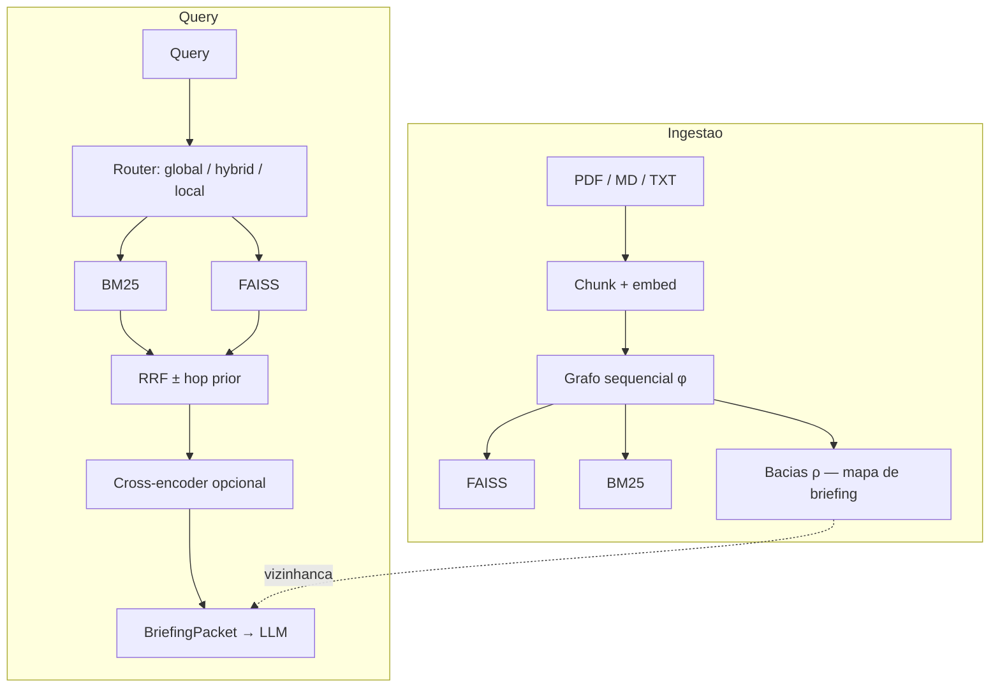

# BasinRAG

<div align="center">

🌐 **[English](README.md)** | **[Português](README_pt.md)**

[](https://www.python.org/downloads/)
[](https://opensource.org/licenses/Apache-2.0)
[](results/gate/decision.json)
[](https://doi.org/10.5281/zenodo.22664948)

**RAG híbrido BM25 + FAISS** com bacias de documento como **mapa de briefing** estruturado para o LLM.

</div>

## O que é o BasinRAG

BasinRAG é um **stack local de retrieval híbrido** para PDF / Markdown / TXT:

1. **Esparso:** BM25 CSR bilíngue  
2. **Denso:** FAISS com `BAAI/bge-base-en-v1.5` (padrão)  
3. **Estrutura:** grafo funcional sequencial $\phi$, atratores e árvores $\rho$ → **bacias**

As bacias definem a **vizinhança de contexto** para o briefing (hubs, vizinhos, L3 opcional). O ranking em corpora flat segue o caminho híbrido BM25 + FAISS. Gate: [`results/gate/decision.json`](results/gate/decision.json) (`CONVERT_C`).

| Capacidade | Papel |
| :--- | :--- |
| **Indexação sem LLM** | Sem extração de entidades / resumos de comunidade na ingestão |
| **Híbrido lexical + denso** | BM25 em termos raros/IDs; dense em paráfrase |
| **Briefing estruturado** | Hubs, vizinhos, L3 opcional para o gerador |
| **Índice local determinístico** | Builds em `.basinrag/builds/<id>/` |

---

## Arquitetura



---

## Benchmarks (resumo)

Protocolo primário de ranking: BEIR-EN-small via MTEB (`--no-rerank`, `bge-base-en-v1.5`). Não é o score overall `MTEB(eng, v2)`.

| Suite | Métrica | Valor |
| :--- | :--- | :---: |
| BEIR-EN-small (5 tarefas) | média nDCG@10 | **0.445** |
| SciFact (MTEB) | nDCG@10 / Recall@10 | **0.733** / **0.866** |
| Long-doc evidence (n=120) | evidence_recall@10 | 0.428 (expand Δ +0.006) |

Tabelas e comandos: [`BENCHMARKS.md`](BENCHMARKS.md). SWE-bench `% Resolved` é board de agente, não score do BasinRAG.

```powershell
python -m basinrag.eval.run_mteb --no-rerank --tasks SciFact,NFCorpus,FiQA2018,ArguAna,SCIDOCS --output results/mteb_beir_arena
```

---

## Funcionalidades

- RRF híbrido; hop prior opcional; cross-encoder opcional  
- Bacias / PPR para expansão de **briefing** local  
- Router `global` / `hybrid` / `local`  
- L3 opcional em background  
- Persistência atômica + FastAPI `/query` e WebSocket `/chat`

### Em relação a outros paradigmas

| | Vector RAG | GraphRAG com LLM | **BasinRAG** |
| :--- | :---: | :---: | :---: |
| Custo de índice | Baixo | Muito alto | **Baixo (local)** |
| Lexical + dense | Às vezes | N/A | **Sim** |
| Estrutura para o LLM | Fraca | Grafo de entidades | **Bacias = mapa de briefing** |

---

## Instalação

```bash
pip install -e ".[dev,api,ollama]"
```

## Quickstart

```python
from basinrag import BasinRAG, BasinRAGConfig

rag = BasinRAG(BasinRAGConfig(storage_dir=".basinrag_index"))
rag.ingest("./meus_documentos")
docs = rag.query("Qual é o princípio central do modelo?", top_k=5)
```

```bash
basinrag ingest ./docs
basinrag query "Quais os principais achados?" --type auto --top-k 5
basinrag chat
basinrag serve --port 8000
```

## Configuração

| Variável | Padrão | Descrição |
|---|---|---|
| `BASINRAG_ENCODER_MODEL` | `BAAI/bge-base-en-v1.5` | Encoder denso |
| `BASINRAG_STORAGE_DIR` | `.basinrag` | Raiz do índice |
| `BASINRAG_LLM_PROVIDER` | `ollama` | Chat / L3 |
| `BASINRAG_LLM_MODEL` | `qwen2.5` | Modelo de chat |

Chunks padrão: **512 / overlap 128**. Ver [docs/API_REFERENCE.md](docs/API_REFERENCE.md).

## Documentação

- [BENCHMARKS.md](BENCHMARKS.md)  
- [ARCHITECTURE.md](ARCHITECTURE.md)  
- [docs/INDEX.md](docs/INDEX.md)  
- [AUDIT_REPORT.md](AUDIT_REPORT.md)  

## Citação

```bibtex
@software{martins2026basinrag,
  author       = {Alex Martins},
  title        = {BasinRAG: Hybrid BM25+FAISS RAG with Dynamical Basins as Briefing Maps},
  year         = {2026},
  publisher    = {Zenodo},
  version      = {v1.0.4},
  doi          = {10.5281/zenodo.22664948},
  url          = {https://doi.org/10.5281/zenodo.22664948}
}
```

## Licença

Apache License 2.0 — ver [LICENSE](LICENSE).
