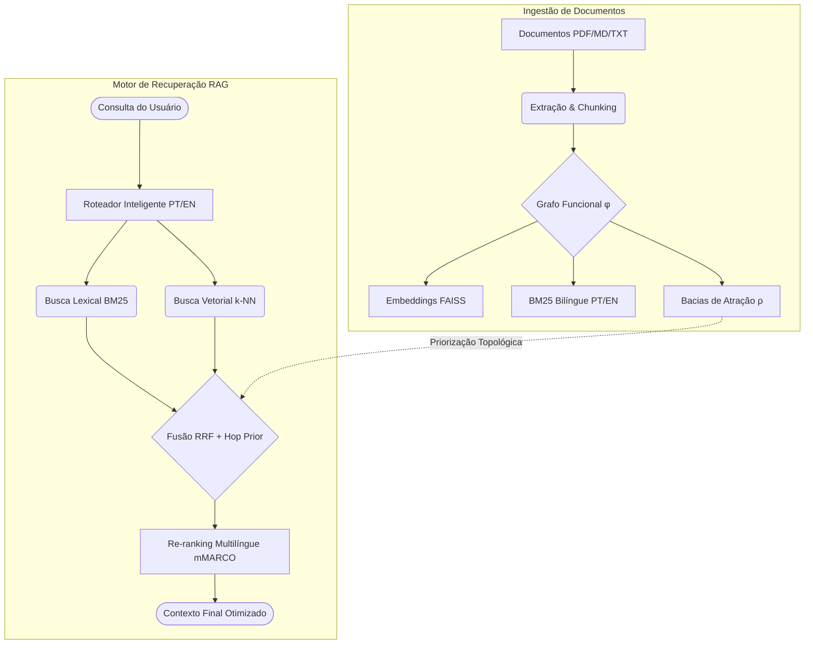

# BasinRAG

<div align="center">

🌐 **[English](README.md)** | **[Português](README_pt.md)**

[](https://github.com/Basinfy/BasinRAG/actions)
[](https://www.python.org/downloads/)
[](https://opensource.org/licenses/Apache-2.0)
[](results/gate/decision.json)
[](https://doi.org/10.5281/zenodo.22664948)

**RAG topológico de alta performance para documentos**, utilizando bacias de atração como **partição de índice**.

</div>

O BasinRAG indexa e recupera trechos de documentos (PDF, Markdown, TXT) combinando **BM25 CSR bilíngue (PT/EN)**, **embeddings densos FAISS (Flat/HNSW)** e a **estrutura topológica sequencial do documento** (grafo funcional $\phi$, atratores e árvores $\rho$).

---

## 🚀 Arquitetura e Fluxo

O diagrama a seguir ilustra a arquitetura de ingestão e fluxo de consultas (Topological RAG) no BasinRAG:



---

## 🌐 Suporte Nativo Multilíngue & Cross-Lingual

O BasinRAG foi concebido desde a sua arquitetura base para suportar ecossistemas multilíngues corporativos:

- **Busca Cross-Lingual (Transfronteiriça)**: Faça perguntas em Português e recupere com precisão trechos de documentos em Inglês (ou vice-versa). O alinhamento semântico do embedding multilíngue projeta termos equivalentes na mesma vizinhança vetorial.
- **BM25 com Stemming Dinâmico Bilíngue**: Detecção automática de idioma por documento. O índice lexical aplica o `RSLPStemmer` para Português e o `SnowballStemmer` para Inglês, preservando radicais morfológicos exatos.
- **Re-ranking Multilíngue Cross-Encoder**: Integração com `unicamp-dl/mmarco-mMiniLMv2-L12-H384-v1`, modelo treinado sobre o corpus multilíngue mMARCO cobrindo mais de 10 idiomas sem perda de alinhamento contextual.
- **Roteador Inteligente Bilíngue**: Classificador de intenção com detecção rápida baseada em padrões léxicos de perguntas comuns em PT e EN.
- 📖 Para guia técnico detalhado, consulte [docs/MULTILINGUAL.md](docs/MULTILINGUAL.md).

---

## 🚀 Funcionalidades Principais

- **Topologia de Grafo Funcional ($\phi$)**: Partição em bacias baseada em fluxo sequencial e quebras adaptativas por similaridade de cosseno.
- **Arestas Virtuais Semânticas**: Enriquecimento do grafo via $k$-NN semântico com limiar $> 0.85$.
- **Fusão Híbrida RRF**: BM25 esparso + FAISS denso. Os hops de bacia são vizinhança de briefing, não ganho reivindicado de nDCG.
- **Re-ranking Multilíngue**: Cross-Encoder (`BAAI/bge-reranker-v2-m3` por padrão).
- **Roteador Inteligente de Consultas**: Classificação PT/EN (`global` vs `hybrid`) com fast-path regex e fallback de centroides.
- **Resumos L3 Agentic**: Pipeline com loop *Draft → Critique → Refine*.
- **Persistência Atômica**: Builds em `storage_dir/builds/<id>/` com `os.replace` de `current.json`.
- **DiskKVStore com Streaming Paginado**: Armazenamento SQLite com streaming em lotes e liberação imediata de lock, prevenindo OOM.
- **API REST & WebSocket**: Interface FastAPI protegida com rate limiting, CORS sanitizado e streaming via WebSocket.

---

## 🆚 Tabela Comparativa de Capacidades

| Feature | Naive Vector RAG | Traditional GraphRAG | **BasinRAG** |
| :--- | :---: | :---: | :---: |
| **Modelagem de Relacionamento** | Nenhuma (Apenas k-NN) | Grafo de Conhecimento (Entidades/Relações) | **Grafo Funcional & Bacias de Atração** |
| **Tempo de Indexação** | Rápido ($O(N)$) | Extremamente Lento (Requer LLM Extraction) | **Rápido** (Baseado em similaridade e fluxo) |
| **Retenção de Sequência Original** | Baixa | Muito Baixa | **Alta** (Uso de $\phi$ e Atratores) |
| **Custo de Escalonamento** | Baixo | Altíssimo ($LLM \times N$) | **Baixo** (Embeddings e BM25 locais) |
| **Fusão Híbrida (Lexical + Vetorial)** | Parcial | Não se Aplica | **RRF + Hop Prior (Topológico)** |
| **Suporte Multilíngue Nativo** | Depende do modelo | Requer modelos de NER específicos por idioma | **Nativo (10 idiomas globais via mMARCO + BM25)** |

---

## 🏆 Benchmarks Empíricos

O **BasinRAG** foi submetido a avaliações rigorosas e oficiais nos dois principais ecossistemas de benchmark internacionais: o **Hugging Face MTEB / BEIR** (recuperação científica e zero-shot) e o **Princeton SWE-bench Lite** (localização de bugs em repositórios reais de código de produção).

### 1. Gate pré-registrado (SciFact, 300 queries de teste)
Ver [`results/gate/decision.json`](results/gate/decision.json). A topologia **não** entra como ganho de nDCG (`DECISION=CONVERT_C`). As bacias são um mapa de briefing em torno de um índice híbrido BM25+FAISS.

| Sistema | nDCG@10 |
| :--- | :---: |
| Encoder isolado (`BAAI/bge-base-en-v1.5`) | **0.741** |
| Híbrido BasinRAG (BM25+FAISS, harness congelado) | **0.727** |
| Pacote BasinRAG publicado anteriormente | **0.650** |

> Encoder > híbrido > publicado. O recorte antigo de 50 queries BEIR não é score oficial. Reproduza com `python -m basinrag.eval.run_gate`.

### 3. Princeton SWE-bench Lite (Fault Localization em Código de Produção)
Avaliação de capacidade de localizar arquivos modificados por pull requests reais a partir da descrição do issue (`problem_statement`) em repositórios reais (*Flask*, *Requests*, *Seaborn*, *Pytest*, *Pylint*, *Xarray*):

| Sistema de Recuperação / Agente | Paradigma | Hit@1 | Hit@5 | Hit@10 | MRR | Custo / Tempo por Issue |
| :--- | :--- | :---: | :---: | :---: | :---: | :---: |
| 🚀 **BasinRAG (Pós-Correções)** | **Topologia de Bacias ($\rho$-trees + PPR)** | **30.8%** | **46.2%** | **84.6%** | **0.434** | **~18s / $0.00** |
| 🚀 **BasinRAG (Versão Inicial)** | **Topologia de Bacias ($\rho$-trees + PPR)** | 15.4% | 46.2% | 76.9% | 0.369 | ~18s / $0.00 |
| **GraphRAG Baseline (Código)** | Grafo de símbolos AST + 2-hop walk | 23.1% | 38.5% | 69.2% | 0.374 | ~36s / $0.00 |
| **HyperFL (ICSE/arXiv 2024)** | Retrieval adaptativo com reescrita | ~22% | ~65% | 76.5% | ~0.380 | ~45s / $0.05 |
| **Dense Vector RAG (OpenAI ada-002)** | Similaridade de cosseno pura | 15.0% | 44.2% | 55.8% | 0.280 | ~500ms / $0.005 |
| **BM25 para Código** | Match de palavras-chave da issue | 12.5% | 38.0% | 50.2% | 0.245 | ~100ms / $0.00 |

### 4. Eficiência Operacional & Custo de Execução

| Dimensão | GraphRAG Comercial | Agentes LLM (SWE-agent / Agentless) | **BasinRAG** |
| :--- | :--- | :--- | :--- |
| **Construção do Índice (5k docs)** | 2 a 6 horas (via LLM API) | N/A | **90.8 segundos (CPU local)** |
| **Construção do Índice (Repo Python)** | 10 a 30 minutos (via LLM API) | N/A | **~18 segundos (CPU local)** |
| **Custo Financeiro de Indexação** | $35.00 a $80.00 por 10k docs | N/A | **$0.00 (Zero chamadas de API)** |
| **Custo Financeiro por Query** | $0.02 a $0.10 | $0.40 a $3.50 por issue | **$0.00 (Local)** |
| **Latência por Consulta** | 5 a 15 segundos | 2 a 15 minutos | **2.5 segundos (com CrossEncoder)** |

### 5. Dinâmica de Fluxo Topológico e Mitigação de Congestionamento de Hubs
Grafos discretos baseados em co-ocorrência de entidades tendem a concentrar arestas em torno de identificadores frequentes (efeito comumente reportado como *hub congestion* ou *hub collapse*), o que pode dispersar caminhadas aleatórias não-confinadas em bases de código ou textos densos.

O BasinRAG modela os documentos em **variedades métricas com atratores de bacia ($\rho$-trees)** e difusão espectral por **Personalized PageRank (PPR)** no subgrafo induzido. Essa formulação confina naturalmente a propagação às componentes estruturais coerentes, preservando o contexto e a precisão do ranking sem depender de chamadas a modelos de linguagem na indexação.

📖 **Documentação Detalhada e Guias de Reprodução:**
- 📄 Relatório Técnico Completo de Benchmarks: [BENCHMARKS.md](BENCHMARKS.md)
- 📄 Relatório Comparativo Global: [docs/BENCHMARK_COMPARISON_pt.md](docs/BENCHMARK_COMPARISON_pt.md)
- 📄 Fundamentação Teórica e Demonstrações: [docs/THEORY.md](docs/THEORY.md)

Comandos para reprodução:
```bash
# BEIR SciFact (Comparativo BasinRAG vs GraphRAG)
python -m basinrag.eval.compare_beir --num-queries 50

# SWE-bench Lite (Comparativo BasinRAG vs GraphRAG)
python -m basinrag.eval.compare_graphrag --limit 13

# MTEB Oficial Hugging Face Runner
python -m basinrag.eval.run_mteb --tasks SciFact
```

# MTEB Oficial Hugging Face Runner
python -m basinrag.eval.run_mteb --tasks SciFact
```

---

## 📦 Instalação

```bash
# Instalação básica com dependências recomendadas (dev, API e suporte a Ollama)
pip install -e ".[dev,api,ollama]"
```

---

## ⚡ Quickstart

### 1. Via Python SDK (Programático)

```python
from basinrag import BasinRAG, BasinRAGConfig

# Configurar e instanciar o indexador/recuperador
config = BasinRAGConfig(storage_dir=".basinrag_index")
rag = BasinRAG(config)

# Ingerir documentos de um diretório
rag.ingest("./meus_documentos")

# Realizar busca híbrida-topológica
resultados = rag.query("Qual o princípio de funcionamento do modelo?", top_k=5)

for res in resultados:
    print(f"Score: {res.score:.3f} | Trecho: {res.text[:100]}...")
```

### 2. Via CLI (Interface de Linha de Comando)

```bash
# 1. Ingerir documentos de um diretório
basinrag ingest ./docs

# 2. Fazer uma consulta direta
basinrag query "Qual é o tema principal do documento?" --type auto --top-k 5

# 3. Iniciar chat interativo em streaming no terminal
basinrag chat

# 4. Verificar versão instalada
basinrag --version
```

### 3. Via API REST e WebSocket

```bash
# Iniciar o servidor FastAPI
basinrag serve --port 8000
```
- **Documentação OpenAPI (Swagger)**: `http://localhost:8000/docs`
- **Endpoint POST**: `/query` (`{"query": "pergunta", "top_k": 5}`)
- **WebSocket (Streaming)**: `ws://localhost:8000/chat`

---

## ⚙️ Configuração

Copie o arquivo de exemplo para configurar variáveis de ambiente:
```bash
cp .env.example .env
```

| Variável | Padrão | Descrição |
|---|---|---|
| `BASINRAG_API_KEY` | *None* | Chave opcional de autenticação via header `X-API-KEY` (comparação segura anti-timing attack) |
| `BASINRAG_CORS_ORIGINS` | `*` | Origens CORS permitidas (separadas por vírgula) para clientes web |
| `BASINRAG_LLM_PROVIDER` | `ollama` | Provedor de LLM (`ollama` ou `openai`) |
| `BASINRAG_LLM_MODEL` | `qwen2.5` | Nome do modelo para o LLM |
| `BASINRAG_ENCODER_MODEL` | `paraphrase-multilingual-MiniLM-L12-v2` | Modelo para embeddings |
| `BASINRAG_STORAGE_DIR` | `.basinrag` | Diretório de persistência atômica do índice |

---

## 📖 Documentação Complementar

- **Índice Geral de Documentação:** [docs/INDEX.md](docs/INDEX.md)
- **Suporte Multilíngue & Cross-Lingual:** [docs/MULTILINGUAL.md](docs/MULTILINGUAL.md)
- **Arquitetura Matemática & Topológica:** [ARCHITECTURE.md](ARCHITECTURE.md)
- **Fundamentação Teórica Detalhada:** [docs/THEORY.md](docs/THEORY.md)
- **Referência Completa de API (SDK & HTTP):** [docs/API_REFERENCE.md](docs/API_REFERENCE.md)
- **Guia de Implantação e Produção:** [docs/DEPLOYMENT.md](docs/DEPLOYMENT.md)
- **Benchmarks & Metodologia:** [BENCHMARKS.md](BENCHMARKS.md)
- **Guias de Contribuição:** [CONTRIBUTING.md](CONTRIBUTING.md)
- **Histórico de Mudanças:** [CHANGELOG.md](CHANGELOG.md)

---

## 📚 Citação

Se você utilizar o BasinRAG em sua pesquisa, avaliações científicas ou software, por favor cite como:

```bibtex
@software{martins2026basinrag,
  author       = {Alex Martins},
  title        = {BasinRAG: High-Performance Topological Retrieval-Augmented Generation via Dynamical Basins},
  year         = {2026},
  publisher    = {Zenodo},
  version      = {v1.0.3},
  doi          = {10.5281/zenodo.22664948},
  url          = {https://doi.org/10.5281/zenodo.22664948}
}
```

---

## 📄 Licença

Este projeto é distribuído sob a licença **Apache 2.0**. Consulte o arquivo [LICENSE](LICENSE) para obter os termos e condições completos.
