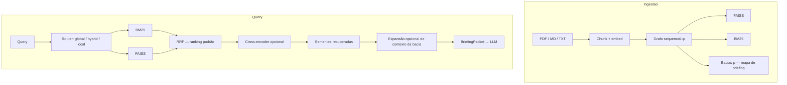

# BasinRAG

<div align="center">

🌐 **[English](README.md)** | **[Português](README_pt.md)**

[](https://www.python.org/downloads/)
[](https://opensource.org/licenses/Apache-2.0)
[](https://doi.org/10.5281/zenodo.22664948)

**Sistema de retrieval local da Basinfy:** RAG híbrido BM25 + FAISS com bacias de documento como **mapa de briefing** estruturado para o LLM. O pacote Python e o comando de terminal se chamam `basinrag`.

</div>

## O que é o BasinRAG

BasinRAG é um **stack local de retrieval híbrido** para PDF / Markdown / TXT:

1. **Esparso:** BM25 CSR bilíngue  
2. **Denso:** FAISS com `BAAI/bge-base-en-v1.5` (padrão)  
3. **Estrutura:** grafo funcional sequencial $\phi$, atratores e árvores $\rho$ → **bacias**

As bacias definem a **vizinhança de contexto** para o briefing (hubs, vizinhos, L3 opcional). O ranking de produção é BM25 + FAISS com RRF; a topologia não reordena as sementes nesse modo. `experimental_topology` é um modo experimental opcional, desligado por padrão.

| Capacidade | Papel |
| :--- | :--- |
| **Indexação sem LLM** | Sem extração de entidades / resumos de comunidade na ingestão |
| **Híbrido lexical + denso** | BM25 em termos raros/IDs; dense em paráfrase |
| **Briefing estruturado** | Hubs, vizinhos, L3 opcional para o gerador |
| **Snapshot local imutável** | Builds no diretório `.basinrag/builds/<id>/` |

---

## Arquitetura



---

## Benchmarks e evidências

Os resultados existentes são históricos e não sustentam claims atuais. Não há pontuação de release declarada até uma execução completa, válida e reproduzível. Protocolo e critérios: [`BENCHMARKS.md`](BENCHMARKS.md). SWE-bench `% Resolved` não é uma métrica de BasinRAG sem patches avaliados pelo harness oficial.

```powershell
python -m basinrag.eval.run_mteb --no-rerank --tasks SciFact,NFCorpus,FiQA2018,ArguAna,SCIDOCS --output results/runs/mteb-$(Get-Date -Format 'yyyyMMdd-HHmmss')
```

---

## Funcionalidades

- RRF híbrido como padrão de produção; ranking topológico é experimental
- Bacias / PPR para expansão de **briefing** local  
- Router `global` / `hybrid` / `local`  
- L3 opcional em background  
- Persistência atômica + FastAPI `/query` e WebSocket `/chat`

### Em relação a outros paradigmas

| | Vector RAG | GraphRAG com LLM | **BasinRAG** |
| :--- | :---: | :---: | :---: |
| Custo de índice | Baixo | Muito alto | **Baixo (local)** |
| Lexical + dense | Às vezes | N/A | **Sim** |
| Estrutura para o LLM | Fraca | Grafo de entidades | **Bacias = mapa de briefing** |

---

## Instalação

```bash
pip install -e ".[dev,api,ollama]"
```

## Quickstart

```python
from basinrag import BasinRAG, BasinRAGConfig

rag = BasinRAG(BasinRAGConfig(storage_dir=".basinrag"))
rag.ingest("./meus_documentos")
docs = rag.query("Qual é o princípio central do modelo?", top_k=5)
```

```bash
basinrag ingest ./docs
basinrag sync ./docs
basinrag query "Quais os principais achados?" --type auto --top-k 5
basinrag chat
basinrag serve --host 127.0.0.1 --port 8000
```

Para migrar um índice legado, reindexe as fontes originais para um destino novo/vazio. O diretório padrão é `.basinrag`; mantenha o índice anterior intacto para rollback:

```bash
basinrag reindex ./meus_documentos --storage-dir ./.basinrag
```

`ingest` é aditivo: fonte nova entra, inalterada é no-op e alterada exige `sync`. A publicação é atômica; falhas de leitura não publicam alterações parciais.

## Configuração

| Variável | Padrão | Descrição |
|---|---|---|
| `BASINRAG_ENCODER_MODEL` | `BAAI/bge-base-en-v1.5` | Encoder denso |
| `BASINRAG_STORAGE_DIR` | `.basinrag` | Diretório de armazenamento |
| `BASINRAG_LLM_PROVIDER` | `ollama` | Chat / L3 |
| `BASINRAG_LLM_MODEL` | `qwen2.5` | Modelo de chat |
| `BASINRAG_RANKING_MODE` | `hybrid_rrf` | `experimental_topology` é opt-in |
| `BASINRAG_API_KEY` | não definido | Obrigatório ao iniciar a API, salvo opt-in local explícito |
| `BASINRAG_CORS_ORIGINS` | origens localhost | Origens separadas por vírgula; wildcard é rejeitado em produção |
| `BASINRAG_ENV` | `production` | `local_dev` só com opt-in sem chave e bind loopback |
| `BASINRAG_ENABLE_BACKGROUND_L3` | `false` | L3 local em background, desligado por padrão |
| `BASINRAG_ALLOW_REMOTE_L3_EGRESS` | `false` | Segundo opt-in para envio de trechos a LLM remoto |
| `BASINRAG_CHUNK_SIZE` | `512` caracteres | Tamanho do chunk legado |
| `BASINRAG_CHUNK_OVERLAP` | `128` caracteres | Overlap legado |
| `BASINRAG_CHUNK_SIZE_TOKENS` | não definido | Limite opcional de tokens do encoder |
| `BASINRAG_CHUNK_OVERLAP_TOKENS` | não definido | Overlap opcional em tokens; exige limite de tokens |

Precedência: **argumentos explícitos > ambiente do processo > `.env` > padrões**. Copie `.env.example` para desenvolvimento local; não versione segredos. Os chunks legados continuam medidos em caracteres e são subdivididos se ultrapassarem a capacidade de tokens do encoder. As opções por tokens são aditivas e não reescrevem índices existentes. Ver [docs/API_REFERENCE.md](docs/API_REFERENCE.md).

## Segurança

Por padrão, a API exige chave mesmo em loopback. O modo sem chave requer `BASINRAG_ENV=local_dev`, `BASINRAG_ALLOW_KEYLESS_LOCAL=true` e bind loopback. IP encaminhado por proxy só é usado para rate limiting, nunca autenticação. L3 fica desligado por padrão; egress remoto exige os dois opt-ins. Conteúdo recuperado é evidência não confiável, não instrução.

## Documentação

- [BENCHMARKS.md](BENCHMARKS.md)
- [ARCHITECTURE.md](ARCHITECTURE.md)
- [docs/INDEX.md](docs/INDEX.md)
- [Índice da documentação](docs/INDEX.md)

## Citação

```bibtex
@software{martins2026basinrag,
  author       = {Alex Martins},
  title        = {BasinRAG: Hybrid Retrieval with Dynamical Basins as Briefing Maps},
  year         = {2026},
  publisher    = {Basinfy},
  version      = {v1.1.0},
  doi          = {10.5281/zenodo.22664948},
  url          = {https://doi.org/10.5281/zenodo.22664948}
}
```

## Licença

Apache License 2.0 — ver [LICENSE](LICENSE).
