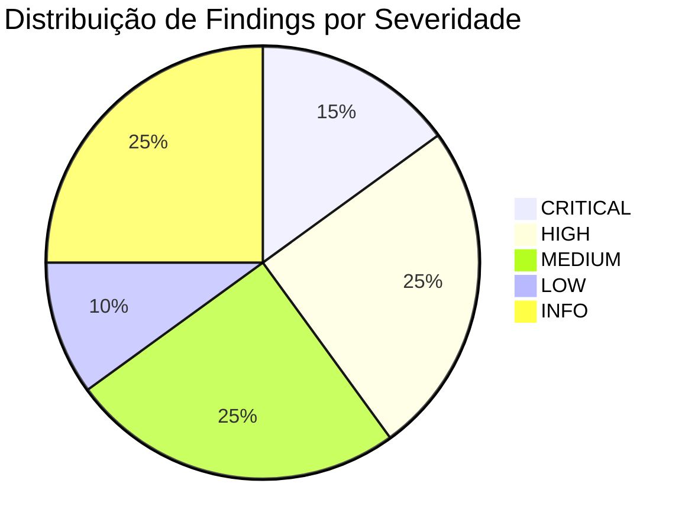

# 🔬 Auditoria Completa do BasinRAG v1.0.0-rc.1

> Relatório de análise minuciosa de especialista em RAG, cobrindo arquitetura, indexação, retrieval, API, testes e fundamentos matemáticos.

**Data:** 2026-09-06 | **Arquivos analisados:** 35+ | **Findings:** 20

---

## Sumário Executivo



| Área | Score | Veredicto |
|---|---|---|
| 🧬 **Fundamentos Matemáticos** | ⭐⭐⭐⭐⭐ | Excelente — implementação correta e elegante |
| 🏗️ **Arquitetura Geral** | ⭐⭐⭐⭐ | Sólida — design diferenciado e coerente |
| 📥 **Pipeline de Indexação** | ⭐⭐⭐ | Bom com falhas pontuais no BM25/stemming |
| 🔍 **Pipeline de Retrieval** | ⭐⭐⭐⭐ | Forte — bug crítico na associação texto↔metadata |
| 💾 **Persistência/Escala** | ⭐⭐ | Fragilidades sérias para corpora grandes |
| 🌐 **API & Segurança** | ⭐⭐⭐ | Funcional com gaps de segurança |
| 🧪 **Testes** | ⭐⭐ | Cobertura insuficiente para produção |

---

## 🏆 Onde Acertamos (Destaques Positivos)

### 1. Fundamentos Matemáticos Impecáveis
A implementação dos **Grafos Funcionais Discretos** é matematicamente sólida e elegante:

- O grafo $\phi$ corretamente impõe grau de saída ≤ 1 para o backbone estrutural
- [`detect_attractors`](file:///c:/Users/Alex%20Martins/Documents/BasinRAG/basinrag/core/functional_graph.py#L89-L122) usa um DFS de 3 estados em $O(V)$ que resolve sinks e ciclos deterministicamente
- A **Profundidade Topológica** via BFS reverso ([`reverse_hops`](file:///c:/Users/Alex%20Martins/Documents/BasinRAG/basinrag/core/functional_graph.py#L131-L155)) está correta
- A **separação estrita** entre arestas $\phi$ estruturais e sinapses kNN semânticas é mantida em toda a codebase

> [!TIP]
> O design topológico determinístico é o grande diferencial do BasinRAG. Enquanto GraphRAG depende de clustering estocástico (Leiden), o BasinRAG garante partições reproduzíveis — uma vantagem real para produção.

### 2. Prior de Decaimento Topológico (Fusão RRF)
A fórmula implementada em [`fusion.py`](file:///c:/Users/Alex%20Martins/Documents/BasinRAG/basinrag/retriever/fusion.py#L27-L37):

$$S_{\text{final}}(v) = S_{\text{RRF}}(v) \cdot (0.7 + 0.3 \cdot e^{-h(v) \cdot \lambda})$$

É uma das melhores práticas do projeto. O floor em `0.7` garante que hits BM25 na periferia da seção não sejam apagados, enquanto nós estruturalmente centrais recebem o boost correto.

### 3. Engenharia de Resiliência
- **Substituição atômica de diretórios**: [`safe_replace_dir`](file:///c:/Users/Alex%20Martins/Documents/BasinRAG/basinrag/core/persistence.py#L46-L92) com retry e fallback para Windows
- **Encoding gracioso**: O [ingestor](file:///c:/Users/Alex%20Martins/Documents/BasinRAG/basinrag/indexer/ingestor.py#L116-L125) testa `utf-8` → `utf-8-sig` → `latin-1` → `autodetect`
- **JSON parsing resiliente**: [`extract_json_payload`](file:///c:/Users/Alex%20Martins/Documents/BasinRAG/basinrag/indexer/summarizer.py#L22-L43) com 3 estágios de fallback para LLMs locais
- **IDs determinísticos (SHA-256)**: Garantem idempotência na re-ingestão
- **Lazy-loading de módulos pesados**: `__init__.py` usa `__getattr__` para manter CLI instantâneo

### 4. Pipeline Agentic Draft→Critique→Refine
O [`BasinSummarizer`](file:///c:/Users/Alex%20Martins/Documents/BasinRAG/basinrag/indexer/summarizer.py#L46-L235) implementa corretamente o loop agentic com:
- Cap de 2 iterações de refinamento (previne loops infinitos)
- Semáforo de concorrência (3 bacias simultâneas)
- Salvamento incremental durante background summarization

### 5. Sections Adaptativas
[`adaptive_section_breaks`](file:///c:/Users/Alex%20Martins/Documents/BasinRAG/basinrag/core/functional_graph.py#L31-L59) detecta quebras semânticas por similaridade de cosseno, com fallback para tamanho fixo quando embeddings não estão disponíveis. Design robusto.

---

## 🚨 Bugs e Falhas Críticas

### CRITICAL-01: Metadados Desalinhados Após Reranking

> [!CAUTION]
> **Severidade: CRITICAL** — Causa atribuição errada de fontes/citações em produção

**Arquivo:** [`retriever/base.py`](file:///c:/Users/Alex%20Martins/Documents/BasinRAG/basinrag/retriever/base.py#L91-L150)

O reranking em `brief()` reordena e trunca `packet.hubs` e `packet.neighbors`, **mas não reordena `packet.node_ids`**. Em `_get_relevant_documents`, o código assume que `packet.node_ids[i]` corresponde ao texto na posição `i`, mas após o rerank os índices estão completamente desalinhados.

**Impacto:** Documentos retornados terão o texto correto mas metadados errados (`source`, `doc_id`, `page`). Isso quebra citações, rastreabilidade e qualquer downstream que dependa de metadata.

```python
# ❌ Problema atual (L91-101): reordena textos mas não node_ids
ordered = self._reranker.rerank(query, rerankable, top_k=self.top_k)
packet.hubs = [t for t in ordered if t in hub_set]      # ← reordenado
packet.neighbors = [t for t in ordered if t not in hub_set]  # ← reordenado
# packet.node_ids → NÃO reordenado! Desalinhado!
```

**Fix:** Armazenar tuplas `(text, node_id)` ao invés de listas disjuntas, ou reordenar `node_ids` junto com os textos.

---

### CRITICAL-02: DiskKVStore Derrotado pela Serialização In-Memory

> [!CAUTION]
> **Severidade: CRITICAL** — OOM crash em corpora grandes (>100k chunks)

**Arquivo:** [`core/persistence.py`](file:///c:/Users/Alex%20Martins/Documents/BasinRAG/basinrag/core/persistence.py#L134-L135)

O `DiskKVStore` foi introduzido para prevenir OOM mantendo os mapeamentos `successor` e `attractor_of` em SQLite. Porém, `save_topology` executa:

```python
"successor": dict(engine.successor.items()),      # ← puxa TUDO para RAM!
"attractor_of": dict(engine.attractor_of.items()), # ← puxa TUDO para RAM!
```

Isso carrega o banco de dados inteiro na memória, anulando completamente o benefício do `DiskKVStore`.

**Fix:** Remover `successor` e `attractor_of` do `meta.json`. Gerenciar os `.db` diretamente — copiar os arquivos SQLite durante o snapshot atômico.

---

### CRITICAL-03: Logger Ausente no Summarizer Causa Crash em Runtime

> [!CAUTION]
> **Severidade: CRITICAL** — Background summarizer crasheia imediatamente

**Arquivo:** [`indexer/summarizer.py`](file:///c:/Users/Alex%20Martins/Documents/BasinRAG/basinrag/indexer/summarizer.py#L161)

O objeto `logger` é usado extensivamente em `summarize_all` e `summarize_missing_background` (linhas 161, 176, 178, 201, 215, 221, 225, 234), mas **nunca é importado** neste arquivo. Sempre que essas rotinas rodarem, crasheiam com `NameError: name 'logger' is not defined`.

**Fix:**
```python
from ..logging_config import setup_logging
logger = setup_logging()
```

---

## ⚠️ Falhas de Alta Severidade

### HIGH-01: Stemming BM25 Baseado em Acentos — Envenenamento do Índice

**Arquivo:** [`indexer/bm25.py`](file:///c:/Users/Alex%20Martins/Documents/BasinRAG/basinrag/indexer/bm25.py#L46-L59) — Linhas 53-59

A função `stem_token` detecta idioma **por token** verificando se o caracter tem acento Unicode. Sem acento → English stemmer. **~90% das palavras portuguesas** não têm acento ("computador", "gato", "livro", "programa") e serão incorretamente stemmed com regras inglesas.

**Impacto:** Envenenamento severo do índice BM25 e falhas de retrieval em português.

**Fix:** Detecção de idioma no nível do documento (via `langdetect` ou parâmetro explícito), não por token.

---

### HIGH-02: Centroides do Router Não Normalizados

**Arquivo:** [`retriever/router.py`](file:///c:/Users/Alex%20Martins/Documents/BasinRAG/basinrag/retriever/router.py#L82-L85) — Linhas 84-85

Em `train_centroids`, os centroides `_global_centroid` e `_hybrid_centroid` são computados via `np.mean()` sobre embeddings normalizados, mas os centroides resultantes **não são re-normalizados**. A classificação por dot product fica matematicamente enviesada para o cluster mais compacto.

**Fix:**
```python
cls._global_centroid = np.mean(g_embs, axis=0)
cls._global_centroid /= np.linalg.norm(cls._global_centroid)
cls._hybrid_centroid = np.mean(h_embs, axis=0)
cls._hybrid_centroid /= np.linalg.norm(cls._hybrid_centroid)
```

---

### HIGH-03: Amplificação de Ruído no Min-Max Scaling do PPR

**Arquivo:** [`retriever/local_search.py`](file:///c:/Users/Alex%20Martins/Documents/BasinRAG/basinrag/retriever/local_search.py#L155-L158) — Linhas 155-158

O Personalized PageRank é min-max scaled com `rng` floored em `1e-6`. Em subgrafos com scores PPR quase uniformes (ex: 0.010 e 0.011), o scaling explode a diferença, atribuindo 1.0 a um nó e 0.0 a outro. Isso distorce severamente o score final `0.6 * sim + 0.4 * ppr`.

**Fix:** Usar normalização por máximo (`p[nid] / max_v`) ou aplicar um threshold mínimo mais alto para o range (ex: `max(0.01, max_v - min_v)`).

---

### HIGH-04: Gargalo N+1 Queries — DiskKVStore em Loops Tight

**Arquivo:** [`core/topology.py`](file:///c:/Users/Alex%20Martins/Documents/BasinRAG/basinrag/core/topology.py#L167-L170) + [`core/functional_graph.py`](file:///c:/Users/Alex%20Martins/Documents/BasinRAG/basinrag/core/functional_graph.py#L91-L122)

`partition_into_basins` passa `self.successor` (DiskKVStore) diretamente para `detect_attractors` e `reverse_hops`. Esses algoritmos $O(V)$ fazem lookups individuais em loops (`curr = successor.get(curr)`), gerando **milhões de queries SQL sequenciais**.

**Fix:** Materializar temporariamente em dict in-memory para o particionamento, rodar o DFS/BFS, e gravar de volta via `set_many`.

---

### HIGH-05: SSL Desabilitado para Downloads BEIR

**Arquivo:** [`eval/beir.py`](file:///c:/Users/Alex%20Martins/Documents/BasinRAG/basinrag/eval/beir.py#L20-L22)

`ctx.check_hostname = False` e `ctx.verify_mode = ssl.CERT_NONE` abrem vulnerabilidade para ataques Man-in-the-Middle durante download de datasets de avaliação.

---

## 🔶 Gaps de Severidade Média

### MEDIUM-01: Poluição de Stopwords no L1

**Arquivo:** [`indexer/condensation.py`](file:///c:/Users/Alex%20Martins/Documents/BasinRAG/basinrag/indexer/condensation.py#L13-L15) — Linhas 13-15

O extrator L1 pega os tokens mais comuns com `len(t) > 3`, mas **não filtra stopwords**. Palavras como "para", "como", "mais", "sobre" dominam os keywords L1, poluindo a densidade semântica.

**Fix:** Importar `_STOP` de `bm25.py` e filtrar: `if len(t) > 3 and t not in _STOP`.

---

### MEDIUM-02: Neighbors Sempre Vazios no Global Search

**Arquivo:** [`retriever/global_search.py`](file:///c:/Users/Alex%20Martins/Documents/BasinRAG/basinrag/retriever/global_search.py#L99-L110) — Linhas 99-110

A variável `neighbors` é inicializada como `[]` e **nunca populada**. Todos os resultados vão para `hubs`, tornando o `neighbors` lista morta.

**Fix:** Distinguir por hops (`if hops == 0: hubs else: neighbors`) ou remover o campo.

---

### MEDIUM-03: Token no URL do WebSocket

**Arquivo:** [`api/server.py`](file:///c:/Users/Alex%20Martins/Documents/BasinRAG/basinrag/api/server.py#L91-L95)

A autenticação do WebSocket passa o token como query parameter (`?token=...`), que é logado por proxies reversos e CDNs.

**Fix:** Usar subprotocol `Sec-WebSocket-Protocol` ou autenticar via primeira mensagem.

---

### MEDIUM-04: WebSocket Disconnect Logado como Erro

**Arquivo:** [`api/server.py`](file:///c:/Users/Alex%20Martins/Documents/BasinRAG/basinrag/api/server.py#L101-L107)

Desconexões normais caem no `except Exception:` genérico e geram stack trace completo nos logs.

**Fix:** Capturar `fastapi.WebSocketDisconnect` separadamente.

---

### MEDIUM-05: Memory Unbounded para JSON Datasets

**Arquivo:** [`indexer/ingestor.py`](file:///c:/Users/Alex%20Martins/Documents/BasinRAG/basinrag/indexer/ingestor.py#L158-L163)

`ingest_json_dataset` carrega todos os records na memória antes de processar.

**Fix:** Generator pattern ou batch processing.

---

## 📋 Problemas Menores e Melhorias

### LOW-01: Timing Attack na Verificação de API Key
[`api/server.py`](file:///c:/Users/Alex%20Martins/Documents/BasinRAG/basinrag/api/server.py#L68) — Usar `secrets.compare_digest()`.

### LOW-02: Normalização L2 Redundante
[`core/topology.py`](file:///c:/Users/Alex%20Martins/Documents/BasinRAG/basinrag/core/topology.py#L122-L123) — Embeddings já normalizados por `build_ip_index`.

### INFO-01: Ausência de CORS Middleware
[`api/server.py`](file:///c:/Users/Alex%20Martins/Documents/BasinRAG/basinrag/api/server.py#L55-L59) — Sem `CORSMiddleware` para frontends cross-origin.

### INFO-02: Ausência de python-dotenv
`.env.example` existe mas não é carregado automaticamente.

### INFO-03: Estimativa de Tokens por `len(text) // 4`
[`retriever/briefing.py`](file:///c:/Users/Alex%20Martins/Documents/BasinRAG/basinrag/retriever/briefing.py#L12-L13) — Impreciso para texto multilíngue. Considerar `tiktoken`.

### INFO-04: Diretórios de Cache Hardcoded nos Evals
Os scripts de avaliação usam `.basinrag/eval_cache` hardcoded.

### INFO-05: Cobertura de Testes Insuficiente
[`tests/test_cli.py`](file:///c:/Users/Alex%20Martins/Documents/BasinRAG/tests/test_cli.py) cobre apenas `--help` e `query` sem índice. Faltam testes para `ingest`, `chat`, `serve`.

---

## 📊 Mapa de Escalabilidade

> [!IMPORTANT]
> A tabela abaixo mostra limites estimados antes que problemas de performance/estabilidade ocorram:

| Componente | Limite Atual Estimado | Gargalo | Ação Necessária |
|---|---|---|---|
| **DiskKVStore serialization** | ~50k chunks | RAM (CRITICAL-02) | Copiar .db diretamente |
| **Basin files on disk** | ~10k basins | Inodes/FS (HIGH-03) | Consolidar em .jsonl |
| **BM25 JSON persistence** | ~100k docs | RAM spike | Migrar para SQLite |
| **DiskKVStore in loops** | ~200k chunks | I/O (HIGH-04) | Materializar temporário |
| **JSON dataset ingestion** | ~50k records | RAM (MEDIUM-05) | Generator pattern |
| **Graph in-memory** | ~500k chunks | RAM (NetworkX) | OK para uso atual |
| **FAISS FlatIP** | ~1M vectors | CPU (brute-force) | Migrar para IVF/HNSW |

---

## 🗺️ Roadmap de Priorização

### 🔴 Sprint 1 — Bugs Críticos (1-2 dias)
1. **CRITICAL-03** — Adicionar import do logger no summarizer
2. **CRITICAL-01** — Realinhar node_ids com textos após reranking
3. **HIGH-02** — Normalizar centroides do router

### 🟠 Sprint 2 — Estabilidade (3-5 dias)
4. **CRITICAL-02** — Refatorar serialização do DiskKVStore
5. **HIGH-01** — Refatorar stemming BM25 para detecção de idioma por documento
6. **HIGH-03** — Corrigir PPR min-max scaling
7. **MEDIUM-01** — Filtrar stopwords no L1

### 🟡 Sprint 3 — Produção (1 semana)
8. **HIGH-04** — Materializar DiskKVStore para particionamento
9. **MEDIUM-03/04** — Segurança WebSocket
10. **LOW/INFO** — CORS, dotenv, timing attack, testes

---

## ✅ Veredicto Final

O BasinRAG é um **projeto de qualidade técnica acima da média**, com fundamentos matemáticos sólidos e uma arquitetura coerente que resolve problemas reais de RAG de forma inovadora. A abordagem topológica determinística é um diferencial genuíno em relação a sistemas como GraphRAG.

Os problemas encontrados são **corrigíveis** e concentram-se em três áreas:
1. **Desalinhamento de dados** (metadados pós-reranking)
2. **Escalabilidade** (serialização OOM, N+1 queries)
3. **Qualidade de retrieval bilíngue** (stemming heurístico)

Nenhum dos problemas requer redesign arquitetural — são bugs de implementação que podem ser resolvidos em 1-2 sprints.